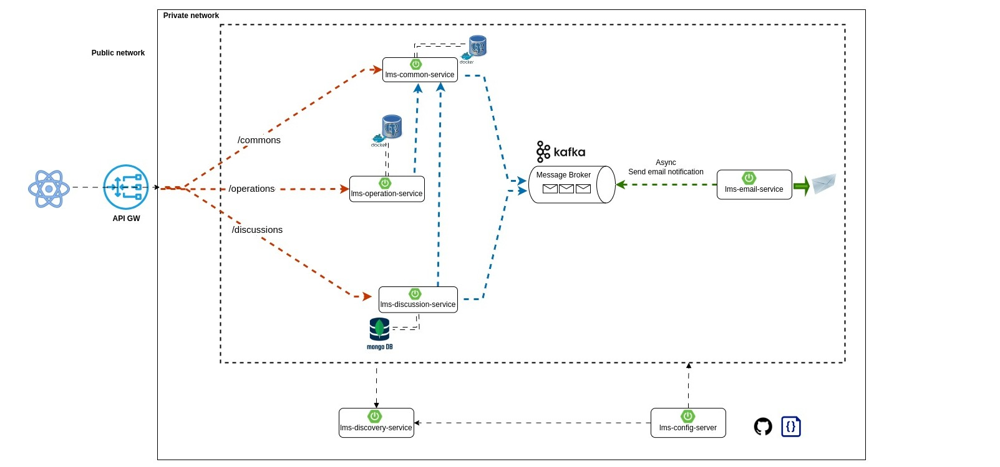

## Learning Management System (LMS)
### Project Description:
The Learning Management System (LMS) is an integrated platform designed to provide a seamless and interactive online learning experience for students, teachers, and administrators. It supports a wide range of educational activities, from content creation and distribution to assessment and analysis.
### System Architecture

The application is designed to use Domain Driven Design pattern with microservice architecture. The whole system is divided into multiple modules and each module is responsible for specific tasks. The interdependency will be maintained using FeignClient. The lms-gateway module is the entry point of the system and communicate with public network. JWT token based security is maintained in this module and the authenticated request will dispatch to internal network where all the other modules handle the request. A short brief of each of the modules are below. 
#### Modules:
1. <b> lms-config-server:</b> This module is used to externalize the configuration for all the individual modules.  
2. <b> lms-discovery-service: </b> This module holds the information about all client-service applications. Every micro modules will register into the lms-discovery-service and this service will know all the client applications running on each port and IP address.
3. <b> lms-domain: </b> This module is not work as a service rather this module will be shared across all the modules. It has domain object, Error object and other important objects that needs to be shared across all modules.
4. <b> lms-common-service: </b>
5. <b> lms-operation-service: </b>
6. <b> lms-discussion-service: </b>
7. <b> lms-gateway: </b>